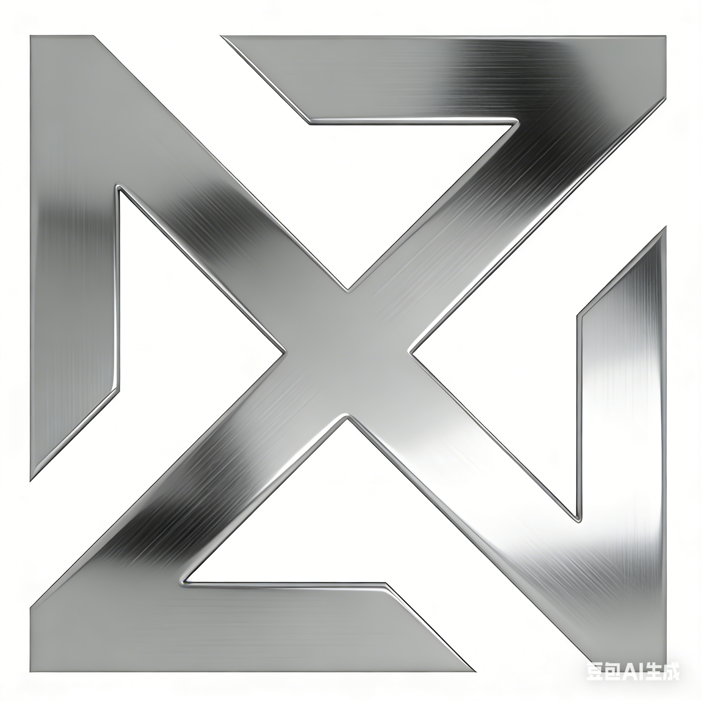

# Preface

Zinc is a systems programming language inspired by Rust, designed to be easier to use.

## Features

1. Statically typed, lightweight runtime, no GC
  * Type-safe
  * Compiles directly to machine code, no virtual machine, fast startup
  * No GC, low memory overhead
  * Control over memory layout
  * LLVM backend, convenient for cross-platform targeting
  * Convenient interop

2. Safety
  * Memory-safe by default; only `unsafe` can introduce undefined behavior
  * Thread-safe by default; only `unsafe` can introduce data races

3. Ease of use
  * Does not pursue zero-cost abstraction
  * No move-semantic types; only move-semantic expressions
  * Has borrow types, but no borrow checker, avoiding the huge impact that ownership + borrow checker have on the overall programming model, and greatly improving on Rust's ease of use

4. Generic functions are implemented primarily via dictionary passing
  * Components can be published as dynamic libraries, and those components can expose complex interfaces, including generics
  * `virtual` functions can carry generic parameters
  * Longer-term, we hope to support a stable ABI so that components can be updated independently without requiring downstream dependents to recompile
  * A compiler option will let users instantiate generic functions for further performance when ABI stability is not a concern

### Compared with Rust

1. Syntax is close to Rust, and the standard library style is close to Rust. It likewise supports memory safety and thread safety.
2. Memory management mainly uses reference counting, not an ownership system.
3. Better ease of use: borrowing is supported, but the borrow checker is removed; move-semantic expressions are supported, but move-semantic types are not.
4. Better support for the object-oriented programming paradigm
5. A different generic implementation: both monomorphization and dictionary passing are supported, selected via a compiler option
6. Some syntax is simplified

### Compared with Swift

1. Better thread-safety support, with compile-time guarantees of thread-safety
2. Platform-neutral; macOS is not the primary platform
3. Drops Objective-C interop, and focuses more on C/C++ interop
4. Supports the OOP paradigm differently; for example, it does not support `class` or inheritance of classes
5. Supports move/borrow differently

### Compared with C++

1. Zinc is safer: without `unsafe`, there is no undefined behavior
2. A different generic implementation: Zinc generic functions can be used as virtual functions, and generic functions can also be compiled to binary code and published via dynamic libraries
3. Longer-term, Zinc can achieve ABI stability
4. Execution performance is considerably worse than C/C++, but should still meet the performance needs of application development
5. Simpler language features, less historical baggage, better runtime dynamism, and smaller code size

### Compared with Go

1. No GC, so memory requirements are lower
2. Richer language features, including generics, traits, enums, pattern matching, and more
3. Better suited to publishing components as dynamic libraries
4. Better thread-safety support
5. Better cross-language interop. Go has its own GC, which makes interop with other GC languages difficult.

## FAQ

### 1. What is Zinc's positioning?

Zinc's original goal is to improve on Rust's ease of use.

In systems language design, there are three common evaluation dimensions: safety, performance, and ease of use. Rust goes to the extreme on safety and performance, but ease of use has always been a pain point.
Zinc keeps safety, while giving up extreme performance in exchange for better ease of use.

The reason for this trade-off is that, in the author's observation, CPU performance is not the bottleneck in the vast majority of scenarios ordinary developers encounter. Cases that squeeze the last drop of CPU performance are rare.
In most cases, people choose a systems language without garbage collection not for extreme performance, but for various other reasons, including but not limited to:

* Wanting strong control over memory layout, and predictable execution performance
* Having cross-platform needs, where porting a VM runtime to some platforms is difficult
* Being on platforms where memory is tight and automatic garbage collection is not viable
* Wanting to write foundational shared component libraries that can be called by many high-level languages using different GC mechanisms. Languages with their own GC struggle to interoperate efficiently in the same process with languages that use a different GC

So a language positioned this way should have suitable use cases:
1. No automatic garbage collection, convenient for cross-platform work, and convenient for interop with many high-level languages. Suitable for writing shared, general-purpose modules.
2. Strong ease of use while remaining safe. Lower requirements on developers, and ample development productivity.
3. Solid performance, without needing to chase extreme performance or squeeze every last bit of hardware potential.

This design does not match Rust's positioning, so these changes can only be attempted by starting a new programming language.

Zinc's positioning is similar to Swift's. The core traits are: no garbage collection + safety + ease of use.
It also has the advantage of thread safety, which Swift does not.

### 2. How does Zinc compare with Rust?

* Rust insists on the "zero-cost abstraction" principle; Zinc drops that design principle. When execution performance and ease of use cannot both be had, ease of use comes first.
* Rust uses an "ownership + lifetimes" mechanism to guarantee memory safety, and the borrow checker checks aliasing XOR mutation at compile time. Zinc uses reference counting and borrowing to guarantee memory safety, and the compile-time rules are much more relaxed. Removing the borrow checker is what makes Zinc's ease of use dramatically better than Rust's.
* Rust implements generics via monomorphization; Zinc implements generics via dictionary passing. That means Rust is not well suited to compiling generic code into binary libraries for external distribution, while Zinc is. Supporting dynamic libraries and ABI stability is an important later goal for Zinc.
* Rust guarantees memory safety and thread safety; Zinc likewise guarantees memory safety and thread safety. Safety is not weakened; there is just a performance cost.

In short: at the syntax and semantics level, Zinc is very close to Rust; at the execution level, Zinc is very close to Swift.

### 3. Why the name Zinc?

Rust stands for rusting and corrosion; Zinc stands for the metal zinc. Zinc has a notable property:

>
> Zinc readily reacts with oxygen in air and forms a zinc oxide layer, i.e. the passivation layer on the surface of a zinc ingot.
> The passivation layer has a protective effect and can inhibit further oxidation and corrosion.
> Zinc's most important application is anti-corrosion galvanization of iron.
>
> Zinc is most commonly used as an anti-corrosion agent, and galvanization (coating of iron or steel) is the most familiar form.
> (from: https://en.wikipedia.org/wiki/Zinc)
>

The word reflects the essence of this language: on the surface Zinc looks like Rust, but beneath the surface syntax, its intellectual core is at odds with Rust.

By coincidence, the word also sounds natural in Chinese, and is a near-homophone of "new language."

### 4. Why choose reference counting (RC) as the main memory-management mechanism?

Advantages of RC:
* One advantage of RC is that it makes memory safety convenient to implement. The theoretical basis for memory safety is "aliasing xor mutation." RC is especially good at tracking aliasing, and together with copy-on-write it can achieve strong safety.
* RC fits Zinc's thread-safety design very well. Thread safety and RC memory management reinforce each other. This is the core reason Zinc cannot use GC. With GC, Zinc would not be able to reach its current level of thread safety.
* Another very good advantage of RC is that it is simple. That means few constraints on the surrounding environment, so interop with any other language is straightforward. GC has far more complex implementation details, and different GC mechanisms struggle to coexist efficiently in the same process. A language with its own GC that tries to interoperate with languages using a different GC is making life hard for itself.

Disadvantages of RC:
* One disadvantage of RC is that it cannot solve leaks caused by cycles. But this is not a memory-safety problem, and its impact is relatively small. Within the space of systems languages, other languages including C++/Rust/Swift have not solved this either. As long as the allocator and debugger work well together, the problem is not hard to find and fix during development and testing. Adding a mark-and-sweep mechanism at runtime solely to solve this would be too expensive and would not match Zinc's positioning. Of course I am not opposed to implementing a heap scanner used only in testing, combined with automated tests, to help find cyclic references in test cases.
* Another disadvantage of RC is that if atomic instructions are used at high frequency to increment and decrement reference counts, execution performance is not good.

But we can use some optimizations to pull performance back a bit:
1. Zinc naturally encourages value-semantic types. In many cases dynamic allocation is unnecessary, and there is reasonably good control over object memory layout. This is cache-friendly and also reduces the situations where reference-counted pointers appear.
2. Zinc keeps borrow pointer types. Copying, passing, and returning borrow pointers does not modify reference counts. In many scenarios, borrow pointers are more appropriate than RC pointers.
3. Zinc keeps move semantics. Used reasonably, this can greatly reduce how often reference counting happens.
4. Zinc's RC pointers are a built-in language type, not simulated by a library. So the compiler has a chance, in some scenarios, to optimize away redundant reference-count increment/decrement operations.
5. Users have the chance to replace libc's malloc/free with a more advanced allocator (such as mimalloc), improving the efficiency of dynamic allocation and deallocation.
6. Using the language's thread-safety features, the compiler can analyze that certain RC pointers and all of their copies can only be used inside the current thread, and can therefore translate those increment/decrement operations into non-atomic instructions. In Zinc, a pointer can be used safely across threads only when it points to a type that satisfies the `Sync` constraint. If a pointer points to a non-`Sync` type, we can be sure that this pointer and all of its copies cannot be used across threads, and that is an optimization opportunity: use non-atomic instructions. **This is also why it is called an automatic reference counting pointer: the letter A stands for Automatic, not Atomic. The main meaning of "automatic" is that the compiler automatically chooses atomic vs. non-atomic instructions.**

These differences show that performance conclusions about traditional atomic-rc implementations in other languages do not apply to Zinc. Compared with traditional atomic-rc, Zinc has better potential for performance optimization.

In short, safety, performance, and ease of use form an impossible triangle.
When Zinc chooses safety and ease of use, it is destined not to achieve "zero-cost abstraction," and some performance loss relative to C/C++ is acceptable.
But we still have a series of optimizations that can keep execution performance from being particularly bad.

My personal guess is that Arc is not Zinc's performance bottleneck; the generic implementation is.

### 5. What is this project's goal?

Rust's design is excellent in many respects; that is plain to see. At the same time, calls to lower Rust's learning and usage barrier have never stopped.
I have always felt that, within the space of safe systems languages, Rust's design direction is not the only solution; there is still other design space.
The purpose of this project is to explore other design possibilities within "safe systems programming languages."

But if we only talk in general terms about how we could design things, no one listens. In programmer circles there is a very famous line:
> 
> Talk is cheap, show me your code.
>

So I need a project that actually implements all of these ideas; only then is it persuasive.

The project's core design direction is:
**What it might look like if we keep Rust's safety, sacrifice a bit of execution performance, and trade that for better ease of use.**

On top of that there are several secondary goals:
1. Simplify language features; oppose feature bloat. Keep different language features as orthogonal as possible so they do not interfere with each other and can be freely combined. Avoid patching semantic rules with special cases. Reduce the user's cognitive load.
2. Simplify the compiler implementation. The Rust compiler is already too complex; few people can fully understand it. Super-complex projects are hard to keep improving and evolving. If a language feature is too complex to implement, that often means users will also be unable to fully master it, so we should avoid introducing such a feature in the first place.
3. Care about compile times for large projects, and provide good IDE hints. This is not only a compiler-implementation problem; it is also a language-design problem.
4. Practice compiler-as-a-service. The compiler should not be a black box; its components should be published as public libraries for the community. Each compiler component should have a clean, easy-to-use public API. That will greatly promote the surrounding ecosystem.
5. Better dynamism on top of a compiled language, including: publishing generic functions as binary artifacts, using generic functions as virtual functions, publishing dynamic libraries as binary artifacts, ABI stability, dynamic loading, and a degree of runtime reflection. These are areas Rust is less good at and Swift is better at.

### 6. Zinc has no particularly novel innovations; it just rearranges features from other languages. Is that meaningful?

It is meaningful. This project's purpose is not innovation; it is safety and ease of use. If the combination of these features ultimately makes users feel safe, easy to use, and well suited to their scenarios, that is enough. Meeting user needs is my goal, not innovation for its own sake.

In systems programming, the choice of languages is not very rich. The author believes there are still some scenarios for which we do not have a particularly suitable language.

* C/C++ is very powerful, but when undefined behavior appears in the code, finding bugs in a large codebase is extremely painful. For ordinary users, the vast majority of scenarios do not need extreme performance; sacrificing a little execution performance for better safety is a worthwhile trade in those cases.
* Rust is a very good language, but some features are overly complex, the programming model is unfriendly to many users, development productivity is low, it is unfriendly to dynamic libraries, and it is not well suited to scenarios that need dynamism.
* Swift is also very good. As a native language it has relatively good dynamism and also supports binary compatibility, which are excellent properties. But it is controlled by Apple and basically only focuses on Apple platforms. In many scenarios we would like to use it but cannot. It also has thread-safety problems.
* Zig, as an emerging systems language, is not yet mature enough, and likewise has memory-safety and thread-safety problems.
* Zinc tries to absorb the strengths of Rust and Swift. First, it aims at Rust's level of safety, with compile-time guarantees of memory safety and thread safety. Second, it simplifies language features and lowers the difficulty of use. Third, it has better dynamism, supporting binary-compatible evolution of dynamic libraries.

In engineering there is no magic, only trade-offs aimed at different goals. Finding a reasonably common use case and designing language features that meet those needs is the main challenge of Zinc's design.
The author believes the combination "no GC & safety & ease of development" is fairly common, and the market lacks a sufficiently competitive language that fully meets it.
Scenarios that pursue "extreme performance" and "zero-cost abstraction" are quite rare in real practice. Projects that treat performance as the highest priority should use C/C++/Rust.
Zinc's design should not treat those needs as first priority.

If you find this design useful, please star the project, leave suggestions, or open a PR and take part in the language's design and implementation.

### 7. What state is Zinc in today?

Core features such as memory management and thread safety have been designed, there is a basic standard library, and on top of those foundations the compiler has been bootstrapped.

The current state can be considered a proof of concept: it is only a start, and it is still far from truly usable.
Many key language features that were not needed for bootstrapping have not been implemented. Planned performance optimizations, surrounding tools, standard-library completeness, and so on have not been done either.
Continued development and maturation still involve a large amount of work, and will only be possible with help from the open-source community.

### 8. Which occasions are a good fit for Zinc? How do you plan to promote it?

I think a new language that tries to seize territory from old languages with mature ecosystems faces enormous difficulty. Conversely, if it can find an industry still in its infancy, deeply cultivate new scenarios, and build a new ecosystem, promotion is much easier.
Growing incremental demand, rather than fighting over existing demand, can greatly lower the cost of promotion.

A few promising new scenarios:

1. Intelligent connected-vehicle products
2. Robotics
3. IoT devices, embedded devices, and various small intelligent devices
4. Artificial intelligence

### 9. Which open-source license did Zinc choose?

Zinc chose the most permissive MIT open-source license. In this era, a programming language that is not open enough cannot attract enough community participants; it is doomed and meaningless.
I hope this project is not only open-source, but also open. I am very willing to hear everyone's opinions and suggestions, and I welcome friends to take part in Zinc's design and implementation.
